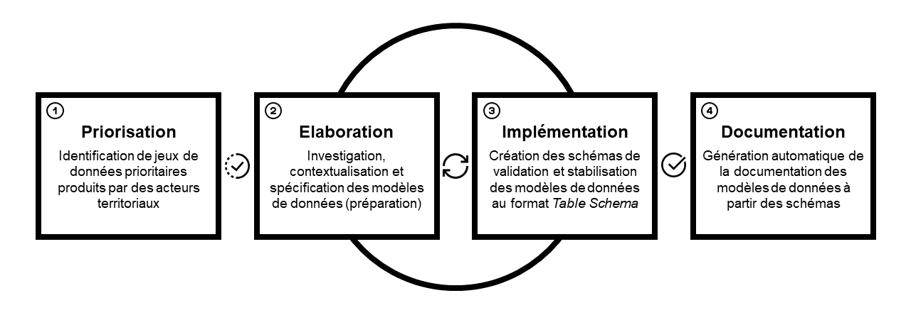

# Socle Commun des Données Locales

Les spécifications des modèles de données applicables aux jeux de données du Socle Commun des Données Locales \(SCDL\) visent à homogénéiser la publication en open data de données essentielles produites par des acteurs territoriaux \(collectivités locales ou partenaires\).

* Elles aident les producteurs à créer et à améliorer la qualité des données qu'ils publient.
* Elles facilitent l'exploitation des données publiées par les réutilisateurs \(agrégation, consolidation et traitements automatiques\).
* Elles portent sur des jeux de données préalablement sélectionnés comme prioritaires.

Le processus de spécification des modèles de données du SCDL peut être représenté comme suit :

## Priorisation

Un [espace de discussion](https://teamopendata.org/c/socle-commun-des-donnees-locales) sur le forum \#teamopendata est consacré au SCDL, à ses usages et à son évolution. Il permet d’identifier des jeux de données prioritaires, de mettre en conversation les propositions d’extension et de faire converger les besoins des producteurs et des réutilisateurs.

## Elaboration 

Un espace de préparation, [accessible sur gitbook.io](https://opendatafrance.gitbook.io/scdl/), permet de préfigurer les spécifications des modèles de données applicables aux jeux de données du SCDL. Cet espace regroupe des [documents de travail](schemas/documents-de-travail/) \(drafts\) qui facilitent la création de nouveaux schémas ou l’amélioration de schémas existants. Ces documents sont élaborés en respectant les [modèles de données élémentaires courantes](https://app.gitbook.com/@opendatafrance/s/scdl/~/drafts/-MVapmCIZ03DzWIhqK2w/modeles) communes à toutes les spécifications.

L'élaboration se traduit essentiellement en deux phases :

* [Investigation](schemas/documents-de-travail/schemas-reflexion/) : un draft de standard est établi par un petit groupe d'acteurs pour tester la pertinence et la faisabilité de la standardisation.
* [Construction](schemas/documents-de-travail/schema-en-discussion/) : le draft établi en phase d'investigation est maintenant soumis à l'approfondissement et la validation d'une représentation maxilmale des parties prenantes. Son issue à court terme sera la publication officielle du standard. 

Il existe un phase spécifque pour la gestion des [évolutions](schemas/documents-de-travail/schemas-en-evolution/) de standards déjà publiés.

## Publication / Implémentation

Dés lors que la phase d'élaboration d'un standard est arrivée à son terme, c'est à dire que le standard est validé par un nombre suffisant d'acteurs et que les description est complète, le standard de données est publié en version officielle. 

Les spécifications des modèles de données sont traduites et implémentées en schémas json, au format [_Table Schema_](https://frictionlessdata.io/specs/table-schema/). Ces schémas sont déposés et mis à jour sur le [GitLab d'OpenDataFrance](https://git.opendatafrance.net/scdl), ou directement sur le\(s\) Github de leur\(s\) auteur\(s\). Ils sont utilisés et exécutés dans [Validata](http://validata.fr) pour vérifier la conformité des jeux de données, avant ou après leur publication. Ces schémas sont élaborés en respectant les [recommandations relatives aux schémas de validation](recommandations-relatives-aux-schemas-de-validation.md), communes à toutes les spécifications.

## Gestion des versions

Les standards publiés pourront évoluer dans le temps en fonction de contraintes : réglementation, adaptation et enrichissement, correction.

Ils suivront alors le processus d'élaboration puis, lorsqu'ils seront validés, ils seront publiés officiellement. La version la plus récente est celle applicable. Les versions antérieures des standards seront conservés pour assurer la compatibilité et l'historique.

## Documentation

La [documentation](https://scdl.opendatafrance.net/docs/) fournit des éléments de contexte, décrit la structure, les champs et les contenus attendus pour chaque modèle de données, et donne accès à des informations complémentaires. Elle est générée automatiquement à partir des schémas. De fait, elle expose toujours la dernière version de chaque spécification et sert de référence ultime pour les producteurs et les réutilisateurs. Son versionnage repose sur des [principes identiques à ceux qui régissent les schémas](recommandations-relatives-aux-schemas-de-validation.md#recommandations-pour-le-versionnage-des-schemas) à partir desquels elle est générée. Elle peut être [téléchargée en PDF](https://scdl.opendatafrance.net/docs/t%C3%A9l%C3%A9charger.html) à tout moment. Son utilisation requiert alors de vérifier qu'elle n'a pas fait l'objet d'une mise à jour depuis la date du téléchargement.

