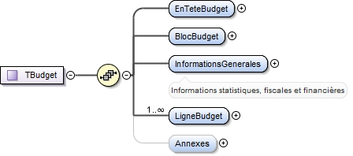

# Budgets

## Contexte <a id="contexte"></a>

Les fichiers `<DocumentBudgetaire>` sont produits par les collectivités territoriales et autres établissements publics dans le cadre du [projet Actes Budgétaires](https://www.collectivites-locales.gouv.fr/actes-budgetaires-1) qui se repose sur la [plateforme @ctes](https://www.collectivites-locales.gouv.fr/actes-0) \([Présentation technique](https://www.collectivites-locales.gouv.fr/files/files/2016_03_11_Presentation_ACTES_Prefets_pr_emetteurs.pdf)\).

Afin d'en simplifier la publication, nous proposons **une version simplifiée** du format XML proposé par le ministère de l’Économie et du budget en lien avec la Direction Générale des Collectivités Locales \(DGCL\) En complément, un outil de transformation des fichiers XML "TOTEM" en fichiers csv pourra être proposé afin de faciliter la génération de ces fichiers de publication simplifiés.

En effet, à ce jour, plusieurs collectivités ont publié leurs données budgétaires mais le nom des colonnes et leur nombre est différent quasiment pour chacune. Afin d'**harmoniser la publication de ces informations essentielles à la transparence démocratique et à l'évaluation des politiques publiques**, ce schéma simplifié contient l'essentiel des données budgétaires.

En complément, nous fournissons une documentation du schéma XSD fourni par le ministère de l’Économie et du Budget afin de contextualiser les choix opérés dans la construction du schéma de données simplifié.

### Proposition de schéma budgétaire

Ce schéma reprend les données de la section LigneBudget du schéma Totem. **Il permet de rattacher un montant de recette ou de dépense à une nature \(quoi?\) et une fonction \(pourquoi ?\) comptable.**  
Afin de rendre l'information plus compréhensible des colonnes contenant les libellés des articles et des des fonctions serait préférable. Cependant ces informations ne sont pas dans les fichiers générés par les collectivités locales à destination de la DGCL et peuvent être déduites en se référant au plan de compte associé à chaque typologie de collectivité. Un outil générant les fichiers csv à partir des fichiers TOTEM pourrait donc les générer à la volée.

<table>
  <thead>
    <tr>
      <th style="text-align:left">Nom</th>
      <th style="text-align:left">Type</th>
      <th style="text-align:left">Description</th>
      <th style="text-align:left">Exemple</th>
      <th style="text-align:left">Propri&#xE9;t&#xE9;s</th>
    </tr>
  </thead>
  <tbody>
    <tr>
      <td style="text-align:left">Nature</td>
      <td style="text-align:left">cha&#xEE;ne de caract&#xE8;res</td>
      <td style="text-align:left">Nature de la d&#xE9;pense ou recette</td>
      <td style="text-align:left">6032</td>
      <td style="text-align:left">Valeur obligatoire, Motif : <code>^\d{1-5}$</code>
      </td>
    </tr>
    <tr>
      <td style="text-align:left">Fonction</td>
      <td style="text-align:left">cha&#xEE;ne de caract&#xE8;res</td>
      <td style="text-align:left">
        <p></p>
        <p>Permet de d&#xE9;terminer la fonction de la d&#xE9;pense ou de la recette,
          c&apos;est-&#xE0;-dire au &quot;pourquoi&quot;. Le num&#xE9;ro est un num&#xE9;ro
          de fonction. Exemples de fonction : &#xE9;ducation, s&#xE9;curit&#xE9;.</p>
      </td>
      <td style="text-align:left">78</td>
      <td style="text-align:left">Valeur obligatoire, Motif : <code>^\d{1-5}$</code>
      </td>
    </tr>
    <tr>
      <td style="text-align:left">ContNat</td>
      <td style="text-align:left">cha&#xEE;ne de caract&#xE8;res</td>
      <td style="text-align:left">
        <p></p>
        <p>destin&#xE9;e &#xE0; recevoir le niveau de vote des cr&#xE9;dits. Le niveau
          d&#xE9;crit doit &#xEA;tre soit identique soit plus agr&#xE9;g&#xE9; que
          le niveau d&apos;ex&#xE9;cution.</p>
      </td>
      <td style="text-align:left">33</td>
      <td style="text-align:left">Valeur obligatoire, Motif : <code>^\d{1-5}$</code>
      </td>
    </tr>
    <tr>
      <td style="text-align:left">ArtSpe</td>
      <td style="text-align:left">cha&#xEE;ne de caract&#xE8;res</td>
      <td style="text-align:left">permet de caract&#xE9;riser un article comme sp&#xE9;cialis&#xE9; ou pas</td>
      <td
      style="text-align:left">Article non sp&#xE9;cialis&#xE9;</td>
        <td style="text-align:left">Valeur: obligatoire, Valeurs autoris&#xE9;es : Article sp&#xE9;cialis&#xE9;,
          Article non sp&#xE9;cialis&#xE9;</td>
    </tr>
    <tr>
      <td style="text-align:left">CodRD</td>
      <td style="text-align:left">bool&#xE9;en</td>
      <td style="text-align:left">cette zone permet de d&#xE9;terminer le sens (recette - d&#xE9;pense)
        du cr&#xE9;dit concern&#xE9;.</td>
      <td style="text-align:left">0</td>
      <td style="text-align:left">Valeur: obligatoire, Valeurs autoris&#xE9;es : 0, 1</td>
    </tr>
    <tr>
      <td style="text-align:left">MtBudgPrec</td>
      <td style="text-align:left">d&#xE9;cimal</td>
      <td style="text-align:left">
        <p></p>
        <p>montant pr&#xE9;vu lors de l&apos;exercice pr&#xE9;c&#xE9;dent. Ce champ
          permet de voir l&apos;&#xE9;volution des montants entre le budget pr&#xE9;visionnel
          (BP), les d&#xE9;cisions modificatives et le compte administratif qui consacre
          la r&#xE9;alit&#xE9; des montants effectivement engag&#xE9;s (pay&#xE9;s
          ou re&#xE7;us).</p>
      </td>
      <td style="text-align:left">23 456.45</td>
      <td style="text-align:left">Valeur: obligatoire</td>
    </tr>
    <tr>
      <td style="text-align:left">MtRARPrec</td>
      <td style="text-align:left">d&#xE9;cimal</td>
      <td style="text-align:left">cette balise est servie au BP/BS/DM uniquement en cas de reprise des r&#xE9;sultats
        de l&#x2019;exercice pr&#xE9;c&#xE9;dent. Cette balise est servie au CA
        pour pr&#xE9;senter les restes &#xE0; r&#xE9;aliser de l&#x2019;exercice
        pr&#xE9;c&#xE9;dent.</td>
      <td style="text-align:left">34 450</td>
      <td style="text-align:left">Valeur: obligatoire</td>
    </tr>
    <tr>
      <td style="text-align:left">MtPropNouv</td>
      <td style="text-align:left">d&#xE9;cimal</td>
      <td style="text-align:left">montant des recettes ou d&#xE9;penses nouvelles c&apos;est-&#xE0;-dire
        non pr&#xE9;vues dans l&apos;&#xE9;tape budg&#xE9;taire pr&#xE9;c&#xE9;dente</td>
      <td
      style="text-align:left">2 345</td>
        <td style="text-align:left">Valeur: optionnelle</td>
    </tr>
    <tr>
      <td style="text-align:left">MtPrev</td>
      <td style="text-align:left">d&#xE9;cimal</td>
      <td style="text-align:left">en pr&#xE9;sence d&apos;une balise MtPrev, celle ci doit obligatoirement
        &#xEA;tre valoris&#xE9;e soit du montant pr&#xE9;vu soit d&apos;un montant
        &#xE9;gal &#xE0; z&#xE9;ro</td>
      <td style="text-align:left">34 450</td>
      <td style="text-align:left">Valeur: obligatoire</td>
    </tr>
    <tr>
      <td style="text-align:left">CredOuv</td>
      <td style="text-align:left">d&#xE9;cimal</td>
      <td style="text-align:left">montant des cr&#xE9;dits de paiement disponibles pour effectuer des d&#xE9;penses
        sur cet article.</td>
      <td style="text-align:left">34 450</td>
      <td style="text-align:left">Valeur: optionnelle</td>
    </tr>
    <tr>
      <td style="text-align:left">MtReal</td>
      <td style="text-align:left">d&#xE9;cimal</td>
      <td style="text-align:left">montant r&#xE9;alis&#xE9; (en d&#xE9;pense ou en recette). Ce champ n&apos;a
        de sens que dans un compte administratif</td>
      <td style="text-align:left">34 000</td>
      <td style="text-align:left">Valeur: obligatoire</td>
    </tr>
    <tr>
      <td style="text-align:left">MtRAR3112</td>
      <td style="text-align:left">d&#xE9;cimal</td>
      <td style="text-align:left">Cette balise est servie au CA. Cette balise peut &#xE9;galement &#xEA;tre
        utilis&#xE9; au BP/BS/DM pour pr&#xE9;senter les informations du CA N-1
        (pr&#xE9;sence des vues &#xAB; Ex&#xE9;cution du budget de l&#x2019;exercice
        pr&#xE9;c&#xE9;dent &#xBB;).</td>
      <td style="text-align:left">23 450</td>
      <td style="text-align:left">Valeur: obligatoire</td>
    </tr>
    <tr>
      <td style="text-align:left">OpBudg</td>
      <td style="text-align:left">cha&#xEE;ne de caract&#xE8;res</td>
      <td style="text-align:left">Cette zone permet d&apos;isoler les op&#xE9;rations d&apos;ordre budg&#xE9;taire.
        Par d&#xE9;faut valeur 0. La valeur &quot;T&quot; est utilis&#xE9;e pour
        les totaux.</td>
      <td style="text-align:left">0</td>
      <td style="text-align:left">Valeur: obligatoire</td>
    </tr>
  </tbody>
</table>## Documentation du schéma TOTEM

Un fichier correspond à **un** document budgétaire d'**une étape budgétaire** \(Budget Primitif, Compte Administratif, etc.\) d'**un établissement public** pour **un exercice** \(une année\). Le format de fichier est commun à tous les types d'établissements publics et de collectivités territoriales. Seuls les plan de compte sont spécifiques à chaque typologie d'établissement public.

Les établissements publics transmettent leurs fichiers `<DocumentBudgetaire>` aux préfectures via le [logiciel TotEM](http://odm-budgetaire.org/). Par abus de langage, on appelle parfois ces fichiers des **"fichiers TotEM"**.

### **C**adre réglementaire

Soutenu par l’[article 74 de la loi MAPTAM](https://www.legifrance.gouv.fr/affichTexteArticle.do;jsessionid=4BB13421F4DDE9243E64831C7343C711.tplgfr32s_2?idArticle=LEGIARTI000028527814&cidTexte=LEGITEXT000028527668&dateTexte=20191018) et l’[article 107 chapitre IV](https://www.legifrance.gouv.fr/affichTexte.do?cidTexte=JORFTEXT000030985460&categorieLien=id#JORFARTI000030987060) de la loi du 7 août 2015 portant Nouvelle Organisation Territoriale de la République, l’adhésion à Actes budgétaires revêtira prochainement un caractère obligatoire pour les métropoles et les collectivités et EPCI à fiscalité propre de plus de 50 000 habitants.

### Usages

La publication des fichiers "TOTEM" produits par l'ensemble des établissements et collectivités publics ayant dématérialisé l'envoi de leurs documents budgétaires afin d'en permettre le contrôle par la Direction Générale des Collectivités Locales \(DGCL\) répondrait à plusieurs objectifs : 

* mettre à disposition des citoyen.nes l'ensemble des informations fiables permettant de rendre compte de leur action administrative
* permettre la visualisation de ces données et contribuer à identifier les missions des collectivités à partir du détail de leurs dépenses.
* faciliter la comparaison entre les établissements comparables \(observatoire indépendant des finances publiques\) et rendre plus transparent leurs orientations budgétaires

En complément, un schéma simplifié des données les plus intéressantes contenues dans ces documents pourrait être proposé afin d'en faciliter la lecture et la réutilisation.

### Documentation existante du fichier

**crédits** : la documentation de ce format de fichier reprend le travail effectué par David Bruant et Matti Schneider sur ce [dépôt Github](https://github.com/DavidBruant/colors-of-the-finances/blob/master/docs/format-fichier.md)

Les documents Budgétaires transmis à la Direction Générale des Collectivités Locales par voie électronique sont structurés dans une grammaire [XML](https://fr.wikipedia.org/wiki/Extensible_Markup_Language). 

Il existe un [XML Schema](https://fr.wikipedia.org/wiki/XML_Schema) décrivant le format utilisé. Le Schéma est maintenu et change régulièrement \(environ 2-3 fois par an sur les 4 dernières années\). On peut [télécharger chaque version du schéma](http://odm-budgetaire.org/composants/schemas/). Il existe une [documentation qui décrit les changements de chaque version](http://odm-budgetaire.org/composants/schemas/schemas.xml). Enfin, une version HTML de [la dernière version du schéma est disponible en ligne](http://odm-budgetaire.org/doc-schema/doc-schema.html).

## Modèle de données <a id="modele-de-donnees"></a>

Le modèle de données se décompose entre des informations d'en-tête et des informations relatives au budget proprement dit.



### **Document Budgétaire**

#### **schemaVersion**

* Titre : version du schéma
* Description : Identifiant de la version du schéma du DocumentBudgetaire utilisé pour structurer les données
* Type : chaîne de caractères
* Exemple : 80
* Valeur : obligatoire
* Motif : **\[0-9a-zA-Z+\_\.\]\***

#### **scellement**

Le scellement est une action qui permet à un ordonnateur d'indiquer qu'il ne fera plus de modification du flux avant son transfert en préfecture ou à la DGFiP. Le scellement n'est pas une signature éléctronique, et n'a pas valeur probante. C'est une empreinte qui permet simplement de savoir si le flux a été altéré pendant son transfert. Avant le calcul de l'empreinte, si le bloc Scellement existe dans le flux il est supprimé. Le flux est ensuite canonisé par canonisation non exclusive sans commentaires.

* Titre : scellement du flux budgétaire
* Description : somme de contrôle générée avant l'envoi permettant de valider la non-altération du fichier durant la transmission

**md5**

* Titre : la somme de contrôle calculée avec l'algorithme de hashage MD5
* Type : chaîne de caractères
* Exemple : 9c63f8cb097f133791033ca83ffde333
* Valeur : obligatoire
* Motif : \[0-9a-f\]{32}$

**sha1**

* Titre : la somme de contrôle calculée avec l'algorithme de hashage SHA1
* Type : chaîne de caractères
* Exemple : 9672e65b06fc1d3fc1516992efd274948abaf362
* Valeur : obligatoire
* Motif : \[0-9a-f\]{40}$

**date**

* Titre : la date du scellement

  Type : date

* Exemple :  2017-04-25T08:11:48
* Valeur : obligatoire
* Motif : xs:dateTime \(ISO 8601\)

### En-tête budgétaire

En-tête du document décrivant le poste comptable et la collectivité 

Exemple : 

```text
<EnTeteDocBudgetaire>Struc
    <DteStr V="2017-03-28"/>
    <LibellePoste V="Payeur Départemental"/>
    <IdPost V="033090"/>
    <LibelleColl V="DEPARTEMENT DE LA GIRONDE"/>
    <IdColl V="22330001300016"/>
    <NatCEPL V="Départements"/>
</EnTeteDocBudgetaire>
```

#### **dteStr**

* Titre : la date où l'établissement a émis le document
* Type : date
* Exemple : 2018-06-24
* Valeur : obligatoire et unique
* Motif : dateTime \(ISO 8601\)

#### **LibellePoste**

* Titre : Libellé du poste comptable
* Type : string
* Exemple : Payeur Départemental
* Valeur : obligatoire et unique
* Motif : \[a-zA-Z\]{100}

#### **IdPost**

* Titre : Identification permanente du poste comptable.
* Type : string
* Exemple : 033090
* Valeur : obligatoire et unique
* Motif : \[0-9\]{7}

#### **LibelleColl**

* Titre : Libellé de la collectivité
* Type : string
* Exemple : Département de la Creuse
* Valeur : obligatoire et unique
* Motif : \[a-zA-Z\]{100}

#### **IdColl**

* Titre : l'identifiant de la collectivité publique. Il s'agit du numéro SIRET.
* Description : Identifiant du [Système d'Identification du Répertoire des Etablissements](https://fr.wikipedia.org/wiki/Syst%C3%A8me_d%27identification_du_r%C3%A9pertoire_des_%C3%A9tablissements) \(SIRET\) de la collectivité attribuant la subvention, composé de 9 chiffres SIREN + 5 chiffres NIC d’un seul tenant.
* Type : chaîne de caractères
* Exemple : 23350001600040
* Valeur : obligatoire
* Motif : `^\d[0-9]{14}$`

#### **FinJur**

* Titre : Finess juridique
* Description : le numéro FINESS \(obligatoire pour la M22 et la M21 \(dans le futur\), non renseigné sinon\)assure l'immatriculation des établissements et entités juridiques porteurs d'une autorisation ou d'un agrément. Numéro à 9 caractères dont les 2 premiers correspondent au numéro du département d'implantation.
* Type : chaîne de caractères
* Exemple : 330796244
* Valeur : facultatif
* Motif : `^\d[0-9]{9}$`

#### **NatCEPL**

* Titre : nature juridique de la collectivité ou établissement public local \(CEPL\)
* Description : les collectivités ou établissements publics sont répartis par catégories juridiques. A chacune de ces catégorie correspond un plan comptable spécifique.
* Type : chaîne de caractères
* Exemple : Département
* Valeur : obligatoire
* Motif : `^\d[a-zA-Z]{100}$`

#### **Département**

* Titre : Le numéro du département
* Description : le numéro d'identification du département le cas échéant codifié sur 3 caractères
* Type : chaîne de caractères
* Exemple : 034
* Valeur : facultatif
* Motif : `^\d[0-9]{3}$`

### Budget

#### **En-tête budget**

Cette section permet de résumer les caractéristiques du type de budget contenu dans le document budgétaire

Exemple : 

```text
<EnTeteBudget>
    <LibelleEtab V="BUDGET PRINCIPAL"/>
    <IdEtab V="22330001300016"/>
    <CodColl V="001"/>
    <CodBud V="00"/>
    <Nomenclature V="M52-M52"/>
</EnTeteBudget>
```

#### **LibelleEtab**

* Titre : Libellé du type de budget de la collectivité
* Description : les collectivités administrent leur finances dans le cadre de plusieurs étapes budgétaires. Le budget principal permet de voter les orientations budgétaires pour l'année à venir. Plusieurs décisions modificatives permettent d'ajuster en cours d'exercice comptable les montants initialement votés \(budget supplémentaire ou décision modificative\). Enfin, le compte administratif récapitule l'ensemble des recettes et dépenses réellement engagées. 
* Type : chaîne de caractères
* Exemple : Compte administratif
* Valeur : obligatoire
* Motif : `^\d[a-zA-Z]{100}$`

#### **IdEtab**

* Titre : numéro SIRET de la collectivité ou établissement
* Description : correspond au SIRET de l'établissement \(parfois, une collectivité possède plusieurs établissements\).
* Type : chaîne de caractères
* Exemple : 2233000130016
* Valeur : obligatoire
* Motif : `^\d[0-9]{14}$`

#### **codeColl**

* Titre : Code collectivité
* Description :  identification de la collectivité ou du budget collectivité
* Type : chaîne de caractères
* Exemple : 001
* Valeur : obligatoire
* Motif : `^\d[0-9]{3}$`

#### **codeBud**

* Titre : Code budget
* Description :  S'il s'agit du budget principal ou si le code collectivité sert déjà à identifier le budget collectivité, cette rubrique est mise à 00.
* Type : chaîne de caractères
* Exemple : 00
* Valeur : obligatoire
* Motif : `^\d[0-9]{2}$`

#### **Nomenclature**

* Titre : Code nomenclature budgétaire
* Description :  chaque catégorie de collectivité ou d'établissement public est soumise à une nomenclature \(ou plan\) comptable \(`M52-M52` pour les départements, `M14_COM_SUP3500` pour les communes de plus de 3500 habitants, etc\) et permet donc d'identifier le type de collectivité. La liste des codes autorisés est publiée sur le site [http://odm-budgetaire.org/](http://odm-budgetaire.org/) onglet Documents éditeurs, sous-onglet Description des nomenclatures. Ce champ est structuré sous la forme "norme"-"déclinaison de norme" \(exemple : M14-M14\_COM\_SUP500\).
* Type : chaîne de caractères
* Exemple : M52-M52
* Valeur : obligatoire
* Motif : `pour 2019 la liste des valeurs autorisées est : M14_CCAS_INF3500, M14_CCAS_SUP3500, M14_CE, M14_COM_500_3500, M14_COM_INF500, M14_COM_SUP3500, M4, M41, M42, M43_A, M43_D, M44, M49_A, M49_D, M52, M57, M61, M71`

### **Bloc budget**

Cette section permet de préciser les caractéristiques du budget

Exemple : 

```text
<BlocBudget>
    <NatDec V="09"/>
    <Exer V="2016"/>
    <DteDec V="2015-12-18"/>
    <DteDecEx V="2015-12-18"/>
    <NatVote V="FcIc"/>
    <OpeEquip V="false"/>
    <VoteFormelChap V="false"/>
    <TypProv V="2"/>
    <BudgPrec V="1"/>
    <ReprRes V="1"/>
    <NatFonc V="3"/>
    <PresentationSimplifiee V="false"/>
    <CodTypBud V="P"/>
    <IdEtabPal V="22330001300016"/>
</BlocBudget>
```

#### **NatDec**

* Titre : Nature de la décision
* Description :  permet de définir la nature du document budgétaire
* Type : chaîne de caractères
* Exemple : 09
* Valeur : obligatoire
* Motif : `la liste des valeurs autorisées correspond aux différentes étapes budgétaires` identifie le type de document :

| valeur | sémantique |
| :--- | :--- |
| 01 | Budget primitif |
| 02 | Décision modificative |
| 03 | Budget supplémentaire |
| 09 | Compte administratif |

#### Exer

* Titre : année de l'exercice budgétaire
* Description :  permet de définir l'année de réalisation du document budgétaire
* Type : chaîne de caractères
* Exemple : 2016
* Valeur : obligatoire
* Motif : `^\d[0-9]{4}$`

### **Lignes budgétaires**

Les lignes constituent le cœur du document budgétaire

Exemple : 

```text
<LigneBudget>
    <Nature V="21313"/>
    <Fonction V="50"/>
    <ContNat V="21"/>
    <ArtSpe V="false"/>
    <CodRD V="R"/>
    <MtBudgPrec V="0.00"/>
    <MtRARPrec V="0.00"/>
    <MtPropNouv V="0.00"/>
    <MtPrev V="0.00"/>
    <CredOuv V="2375.41"/>
    <MtReal V="2375.41"/>
    <MtRAR3112 V="0.00"/>
    <OpBudg V="0"/>
    <MtSup Code="ProdChaRat" V="0.00"/>
    <MtSup Code="BudgetHorsRAR" V="2375.41"/>
</LigneBudget>
```

#### **Nature**

* Titre : Nature de la dépense ou de la recette 
* Description : cette zone permet de déterminer la nature de la dépense ou de la recette, c'est-à-dire au "quoi". Le numéro est un numéro d'article. Exemples de nature : carburant, dépenses de personnel…
* Type : numérique
* Exemple : 21343
* Valeur : obligatoire
* Motif : \[0-9\]{30}

#### **Fonction**

* Titre : Fonction de la dépense ou de la recette 
* Description : cette zone permet de déterminer la fonction de la dépense ou de la recette, c'est-à-dire au "pourquoi". correspond à la fonction de la recette/dépense, c'est-à-dire au "pourquoi". Le numéro est un numéro de fonction. Exemples de fonction : éducation, sécurité.
* Type : numérique
* Exemple : 04
* Valeur : obligatoire
* Motif : \[0-9\]{10}

#### **ContNat**

* Titre : Fonction de la dépense ou de la recette 
* Description : cette zone permet de déterminer la fonction de la dépense ou de la recette, c'est-à-dire au "pourquoi". correspond à la fonction de la recette/dépense, c'est-à-dire au "pourquoi". Le numéro est un numéro de fonction. Exemples de fonction : éducation, sécurité.
* Type : numérique
* Exemple : 04
* Valeur : obligatoire
* Motif : \[0-9\]{10}

#### **ArtSpe**

* Titre : Article spécialisé
* Description : 
* Type : string
* Exemple : article non spécialisé
* Valeur : optionnelle
* Motif : 

#### **CodRD**

* Titre : Code recette / dépense. 
* Description : cette zone permet de déterminer le sens \(recette - dépense\) du crédit concerné.
* Type : booléen
* Exemple : 0
* Valeur : 0=recette, 1=dépense
* Motif : 


À partir de toutes ces informations, on peut savoir le libellé de la dépense ou de la recette en regardant par exemple dans le plan de compte correspondant \(par exemple le [plan de compte](http://odm-budgetaire.org/composants/normes/2016/M52/M52/planDeCompte.xml) départemental M52\), en regardant le tableau "Liste des comptes et utilisations", et en utilisant le `ContNat` comme code pour voir le chapitre correspondant dans la colonne RR pour une recette ou ou DR pour une dépense.

Pour savoir s'il s'agit de fonctionnement ou d'investissement, on peut regarder dans le tableau "Liste des chapitres"  et utiliser le code de chapitre en regardant la colonne _SECTION_.


#### **MtB**udgPrec

* Titre : Montant du budget précédent 
* Description : montant prévu lors de l'exercice précédent. Ce champ permet de voir l'évolution des montants entre le budget prévisionnel \(BP\), les décisions modificatives et le compte administratif qui consacre la réalité des montants effectivement engagés \(payés ou reçus\).
* Type : numérique
* Exemple : 45 678,80
* Valeurs: optionnel
* Motif :

#### **MtRarPrec**

* Titre : Montant restant à réaliser N-1.
* Description : cette balise est servie au BP/BS/DM uniquement en cas de reprise des résultats de l’exercice précédent. Cette balise est servie au CA pour présenter les restes à réaliser de l’exercice précédent.
* Type : numérique
* Exemple : 45 678,80
* Valeurs: optionnel
* Motif :

#### **MtPropNouv**

* Titre : Montant "Propositions nouvelles" 
* Description : montant des recettes ou dépenses nouvelles c'est-à-dire non prévues dans l'étape budgétaire précédente.
* Type : numérique
* Exemple : 45 678,80
* Valeurs: optionnel
* Motif :

#### **MtPrev**

* Titre : montant budget voté 
* Description : en présence d'une balise MtPrev, celle ci doit obligatoirement être valorisée soit du montant prévu soit d'un montant égal à zéro
* Type : numérique
* Exemple : 45 678,80
* Valeurs: optionnel
* Motif :

#### **CredOuv**

* Titre : crédits ouverts à l'article
* Description : montant des crédits de paiement disponibles pour effectuer des dépenses sur cet article.
* Type : numérique
* Exemple : 45 678,80
* Valeurs: optionnel
* Motif :

#### **MtRAR3112**

* Titre : Montant reste à réaliser de l’exercice
* Description : cette balise est servie au CA. Cette balise peut également être utilisé au BP/BS/DM pour présenter les informations du CA N-1 \(présence des vues « Exécution du budget de l’exercice précédent »\).
* Type : numérique
* Exemple : 45 678,80
* Valeurs: optionnel
* Motif :

####  **MtReal**

* Titre : Montant signé des réalisations budgétaires 
* Description : montant réalisé \(en dépense ou en recette\). Ce champ n'a de sens que dans un compte administratif
* Type : numérique
* Exemple : 45 678,80
* Valeurs: optionnel
* Motif :

#### **OpBudg**

* Titre : numéro de compte 
* Description : Cette zone permet d'isoler les opérations d'ordre budgétaire. Par défaut valeur 0. La valeur "T" est utilisée pour les totaux.
* Type : numérique
* Exemple : 0
* Valeurs: 0=opération réelle ou mixte 1=opération d'ordre
* Motif : \[0-9\]{12}

### Annexes

Les annexes contiennent des informations sur le patrimoine détenu par les collectivités ou établissements publics, ses effectifs, les subventions versées, la liste des signataires du budget ou du compte administratifs ou encore les emprunts contractés.

La liste exhaustive peut être trouvée dans le [documentation générée à partir du XML Schema](http://odm-budgetaire.org/doc-schema/Class_Budget_xsd_Complex_Type_TBudget.html#TBudget_Annexes)

Toutes les parties des annexes sont délimitées par des balises `<DATA_XXX>` dont le contenu est une liste d'éléments `<XXX>`.

Certaines sections sont détaillées ci-dessous en raison de leur intérêt en terme d'usage.

#### **Les subventions \(&lt;DATA\_CONCOURS&gt;\)**

```text
<CONCOURS>
    <CodNatJurBenefCA V="P1"/>
    <LibOrgaBenef V="24 HEURES SUD GIRONDE "/>
    <MtSubv V="500.0"/>
</CONCOURS>
```

#### MtSubv

* Titre : Montant de la subvention en euros 
* Description : montant alloué par l'établissement ou la collectivité sous forme de subvention
* Type : numérique
* Exemple : 45 678,80
* Valeurs: optionnel
* Motif : 

#### LibOrgaBenef

* Titre : Nom de l'organisme bénéficiaire
* Description : libellé de l'organisme destinataire de la subvention
* Type : chaîne de caractères
* Exemple : association de tennis de table de Cenon
* Valeurs: optionnel
* Motif : \[a-zA-Z\]{100}

#### Siret

#### CodNatJurBenefCA

* Titre : nature juridique du bénéficiaire
* Description : codification des typologies des bénéficiaires d'aides en argent ou en nature
* Type : chaîne de caractères
* Exemple : P3
* Valeurs: obligatoire
* Motif : \[0-9A-Z\]{2}

| **P1** |  `Associations` |
| :--- | :--- |
| **P2** |  `Entreprises` |
| **P3** |  `Personnes physiques` |
| **P4** |  `Autres personnes de droit privé` |
| **U1** |  `Régions` |
| **U2** |  `Départements` |
| **U3** |  `Communes` |
| **U4** |  `Etablissements de droit public (EPCI, EPA, EPIC, ...)` |
| **U5** |  `Etat` |
| **U6** |  `Autres personnes de droit public` |

Cette information est utilisée par [l'outil d'anonymisation](https://github.com/dtc-innovation/anonymisation-document-budgetaire/) pour anonymiser le `LibOrgaBenef` correspondant.

#### **Patrimoine \(&lt;DATA\_PATRIMOINE&gt;\)**

Il s'agit de tout le patrimoine de la collectivité. On y trouve tout ce qui est possédé des immeubles et voitures jusqu'aux licences logicielles, cafetières ou housses d'ordinateur.

```text
<PATRIMOINE>
    <CodVariPatrim V="01"/>
    <CodEntreeSorti V="E"/>
    <CodModalAcqui V="01"/>
    <LibBien V=" 2016M00712 - CAFETIERE SENSEO PHILIPS"/>
    <MtValAcquiBien V="1942.82"/>
    <MtCumulAmortBien V="0.00"/>
    <MtAmortExer V="0.00"/>
    <DureeAmortBien V="1"/>
    <NumInventaire V="2016M00712"/>
    <DtAcquiBien V="2016-07-07"/>
    <MtVNCBien3112 V="0.00"/>
    <MtVNCBienSorti V="0.00"/>
    <MtPrixCessBienSorti V="0.00"/>
</PATRIMOINE>
```

`NumInventaire` : identifiant du bien. 

`MtValAcquiBien` : valeur d'acquisition du bien.

`DtAcquiBien` : date d'acquisition du bien.

#### **Les emprunts \(&lt;DATA\_EMPRUNT&gt;\)**

Il s'agit des emprunts contractés par la collectivité, souvent pour financer ses investissements. Chaque `<EMPRUNT>` correspond à un emprunt que la collectivité n'a pas encore remboursé entièrement.

```text
<EMPRUNT>
    <CodTypEmpr V="09"/>
    <CodProfilAmort V="X"/>
    <CodProfilAmortDtVote V="X"/>
    <AnEncaisse V="2007"/>
    <ObjEmpr V="6776/1104016/REAMENAGEMENT ET COMPACTAGE"/>
    <MtEmprOrig V="807974.1"/>
    <DureeRest V="1.5"/>
    <DureeRestInit V="1.5"/>
    <LibOrgaPreteur V="CAISSE DEPOTS CONSIGNATIONS"/>
    <CodPeriodRemb V="I"/>
    <CodPeriodRembDtVote V="I"/>
    <CodPeriodRembReneg V="X"/>
    <CodTyptxInit V="V"/>
    <CodTyptxDtVote V="V"/>
    <IndexTxVariInit V="LIVRET A"/>
    <TxActuaInit V="3.438"/>
    <IndexTxVariDtVote V="LIVRET A"/>
    <TxActua V="1.95"/>
    <IndiceEmpr V="EUR"/>
    <MtIntExer V="3963.31"/>
    <MtCapitalExer V="86666.63"/>
    <MtCapitalRestDu_01_01 V="237326.39"/>
    <MtICNE V="721.05"/>
    <MtCapitalRestDu_31_12 V="150659.76"/>
    <NomBenefEmprGaranti V="SA HLM CLAIRSIENNE"/>
    <CodTypEmprGaranti V="03"/>
    <NumContrat V="6776/1104016"/>
    <IndSousJacent V="1"/>
    <IndSousJacentDtVote V="1"/>
    <Structure V="A"/>
    <StructureDtVote V="A"/>
    <DtSignInit V="2007-12-10"/>
    <DtEmission V="01/01/2007"/>
    <Dt1RembInit V="2008-01-01"/>
    <Txinit V="4.2"/>
    <RtAnticipe V="false"/>
    <TypeSortie V="A"/>
    <MtSortie V="0.0"/>
    <Couverture V="false"/>
    <MtCouvert V="0.0"/>
    <Renegocie V="false"/>
    <DureeContratInit V="10.0"/>
    <TxMini V="LIVRET A + 1,20"/>
    <TxMaxi V="LIVRET A + 1,20"/>
    <MtInt778 V="0.0"/>
</EMPRUNT>
```

#### **Relation de la collectivité à l'emprunt**

`CodTypEmpr` identifie notamment si l'emprunt est fait par la collectivité pour elle-même \(`01`\) ou si elle garantit seulement l'emprunt pour un autre établissement \(`09`\).

#### **Emprunt en lui-même**

`DtSignInit` : date de signature de l'emprunt.

`DureeContratInit` : durée initiale de remboursement de l'emprunt \(en années\).

`MtEmprOrig` : montant originel de l'emprunt.

`MtCapitalRestDu_31_12` : montant restant à rembourser.

`Txinit` : taux initial de l'emprunt.

`Structure` : information documentant s'il s'agit d'un emprunt à taux fixe \(`A`\) ou un emprunt plus complexe, dont le taux serait indicé sur le CAC40, une autre monnaie ou autre chose. Il y a habituellement un facteur multiplicateur maximum au taux d'emprunt de base. Si ce facteur dépasse 5, il s'agit d'un emprunt potentiellement dangereux que l'on appelle usuellement « emprunt toxique ». Il est identifié ici par la valeur `F`.

#### **Relation au prêteur**

`LibOrgaPreteur` : organisme prêteur. Il peut s'agir d'établissements publics \(Caisse des dépôts et consignations\) ou privés \(LCL, Crédit agricole…\).

`ObjEmpr` : identifiant du contrat de prêt.

#### **PPP \(&lt;DATA\_PPP&gt;\)**

Données liées aux partenariats public-privé. 

#### **Pret \(&lt;DATA\_PPP&gt;\)**

Argent que l'établissement public prête à d'autres.

```text
<PRET>
    <CodTypPret V="N"/>
    <NomBenefPret V="Nom anonymisé"/>
    <DtDelib V="1990-01-15"/>
    <MtCapitalRestDu_31_12 V="1290.48"/>
    <MtCapitalExer V="0.0"/>
    <MtIntExer V="0.0"/>
</PRET>
```

Les prêts ne renseignent pas la nature juridique du bénéficiaire \(par un élément `CodNatJurBenefCA` comme on peut trouver dans les subventions\). Vu que certains prêts sont faits à des personnes physiques, il a été nécessaire d'anonymiser tous les prêts.

#### **Personnel \(&lt;DATA\_PERSONNEL&gt;\)**

Liste de tous les personnels de la collectivité publique.

```text
<PERSONNEL>
    <CodTypAgent V="I"/>
    <EmploiGradeAgent V="Adjoint territorial du patrimoine principal de 1ère classe"/>
    <CodCatAgent V="C"/>
    <TempsComplet V="true"/>
    <Permanent V="true"/>
    <CodSectAgentTitulaire V="CULT"/>
    <IndiceAgent V="'400"/>
    <EffectifBud V="1.0"/>
    <EffectifPourvu V="1.0"/>
</PERSONNEL>
```

Il est possible que la combinaison des informations `EmploiGradeAgent`, `TempsComplet`, `CodCatAgent`, `CodSectAgentTitulaire`, `Permanent` puisse permettre l'identification de la personne physique concernée si l'on croise ces informations avec des connaissances personnelles ou des informations disponibles sur Internet \(réseaux sociaux professionnels type Linkedin\), surtout dans des petites collectivités qui comptent peu d'agents.

`IndiceAgent` renseigne l'indice de l'agent de la collectivité. 

#### **Signature et signataires**

```text
<DATA_SIGNATURE>
    <SIGNATURE>
        <NbrMembExer V="66"/>
        <NbrMembPresent V="47"/>
        <NbrSuffExprime V="46"/>
        <NbrVotePour V="31"/>
        <NbrVoteContre V="15"/>
        <NbrVoteAbstention V="0"/>
        <DtConvoc V="2017-03-29"/>
        <LibPresentPar V="Monsieur le Président"/>
        <LibPresentLieu V="Hôtel du Département Esplanade Charles de Gaulle 33 BORDEAUX"/>
        <DtPresent V="2017-04-13"/>
        <LibDelibPar V="l'Assemblée délibérante"/>
        <LibReuniSession V="Plénière du 13 avril 2017"/>
        <LibDelibLieu V="Hôtel du Département Esplanade Charles de Gaulle 33 BORDEAUX"/>
        <DtDelib V="2017-04-13"/>
        <DtTransmPrefect V="2017-04-24"/>
        <DtPub V="2017-04-24"/>
        <LibFin V="Hôtel du Département Esplanade Charles de Gaulle 33 BORDEAUX"/>
        <DtfFin V="2017-04-24"/>
    </SIGNATURE>
</DATA_SIGNATURE>
<DATA_SIGNATAIRE>
    <SIGNATAIRE>
        <Signataire V="GLEYZE Jean-Luc"/>
    </SIGNATAIRE>
    <!-- autres signataires omis -->
<DATA_SIGNATAIRE>
```

Informations sur le vote et la signature du document en question ainsi que la liste des signataires \(élu·e·s\).

## Exemples de documents <a id="voir-aussi"></a>

Des exemples de fichiers "TOTEM" sont disponibles sur des portails opendata de collectivités locales :

* [département de la Gironde](https://www.datalocale.fr/dataset?q=totem)
* [métropole de Bordeaux](https://opendata.bordeaux-metropole.fr/explore/?disjunctive.publisher&disjunctive.frequence&disjunctive.territoire&sort=title&q=budget)

## Voir aussi <a id="voir-aussi"></a>

* [exemple de visualisation](https://www.gironde.fr/un-budget-au-service-des-solidarites-humaine-et-territoriale) du compte administratif du Département de la Gironde
* [documentation exhaustive](http://odm-budgetaire.org/doc-schema/doc-schema.html) du schéma XSD 
* [outil d'anonymisation](https://github.com/dtc-innovation/anonymisation-document-budgetaire/) permettant de supprimer le nom des bénéficiaires de type personne physique de la section data\_concours

**exemples de fichiers publiés :** 

* [comptes administratifs](https://www.datalocale.fr/dataset/comptes-administratifs-budget-principal-donnees-budgetaires-du-departement-de-la-gironde) du Département de la Gironde
* [comptes administratifs](https://opendata.bordeaux-metropole.fr/explore/?disjunctive.publisher&disjunctive.frequence&disjunctive.territoire&sort=title&q=compte+administratif) de la métropole de Bordeaux \(en pièce jointe\) 
* [compte administratif](https://www.data.gouv.fr/storage/f/2014-02-14T16-46-33/CA2012.xml) de la ville d'Issy-les-Moulineaux \(fichier XML stocké sur data.gouv.fr\)


